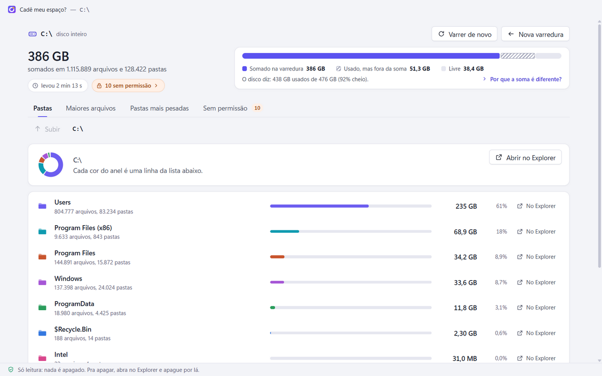
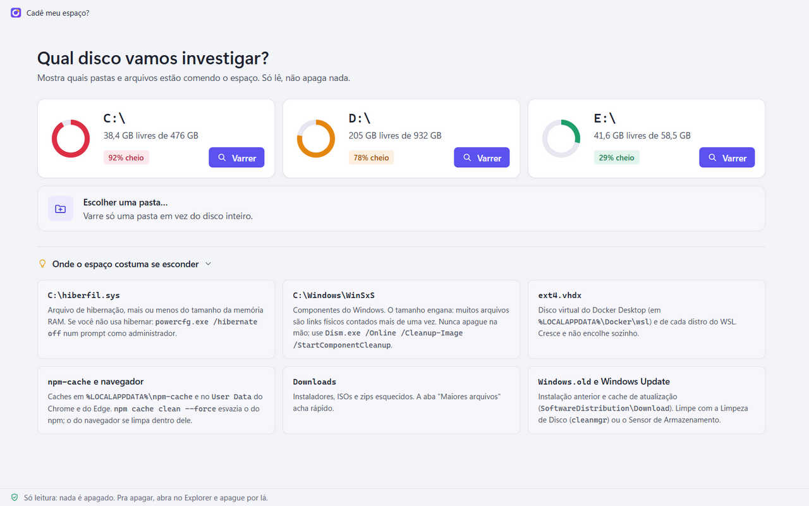
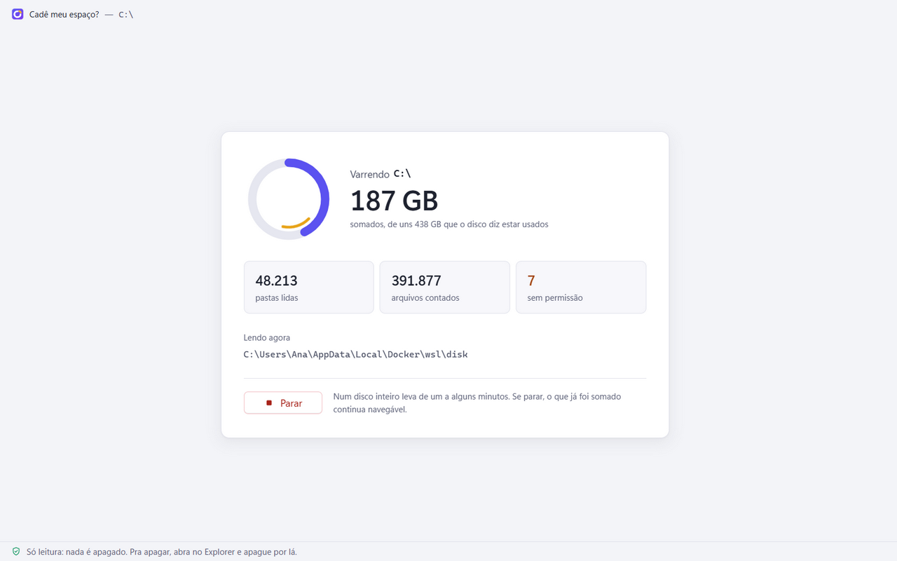
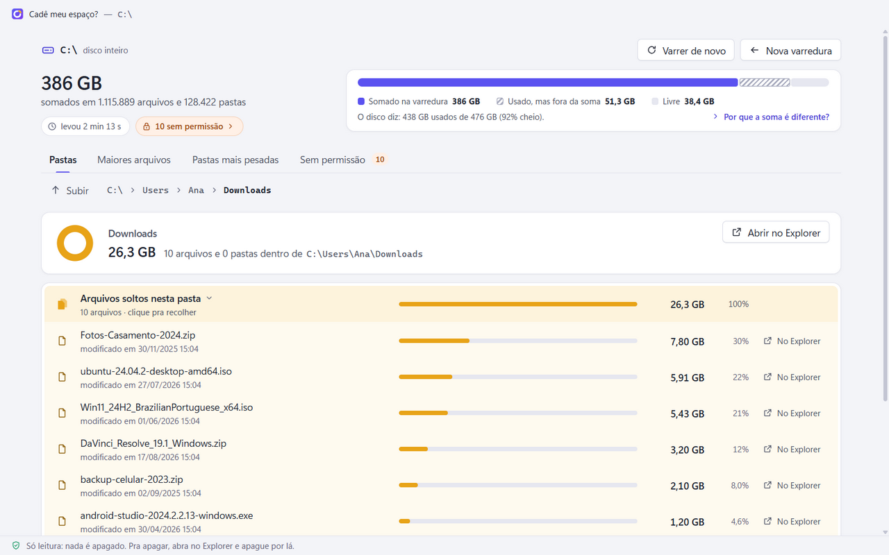
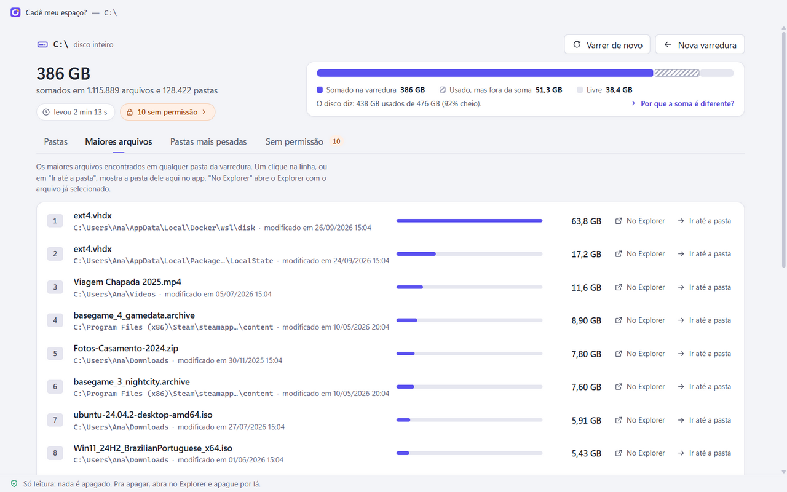
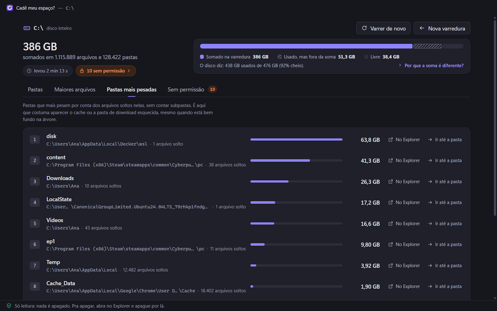
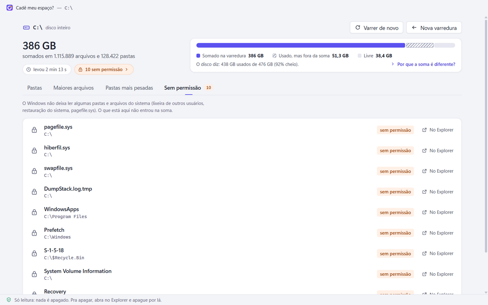

# Cadê meu espaço?

App pra Windows que varre um disco (ou uma pasta) e mostra exatamente quais
pastas e arquivos estão comendo o espaço. Só lê. Não apaga nada. Pra apagar,
ele abre a pasta no Explorer e você decide.

<picture>
  <source media="(prefers-color-scheme: dark)" srcset="docs/capturas/pastas-escuro.png">
  
</picture>

Feito em Node.js + Electron. O núcleo da varredura é Node puro, então também
roda no terminal sem o Electron (útil quando o disco está tão cheio que nem dá
pra baixar coisa nova).

As capturas desta página usam um `C:\` de demonstração, com números
inventados (ver [Testes](#testes)).

## Sumário

1. [Baixar](#baixar)
2. [Se o disco está lotado, comece pelo terminal](#se-o-disco-está-lotado-comece-pelo-terminal)
3. [Como usar, tela por tela](#como-usar-tela-por-tela)
4. [Onde o espaço costuma se esconder no Windows](#onde-o-espaço-costuma-se-esconder-no-windows)
5. [O que ele faz e o que não faz](#o-que-ele-faz-e-o-que-não-faz)
6. [Pra desenvolvedores](#pra-desenvolvedores)
7. [Como funciona por dentro](#como-funciona-por-dentro)
8. [O que foi testado e o que não foi](#o-que-foi-testado-e-o-que-não-foi)
9. [Licença](#licença)
10. [Fontes](#fontes)

## Baixar

Na [página da versão mais nova](https://github.com/A2Reis/cade-meu-espaco/releases/latest)
tem dois arquivos. Escolha um:

- **`CadeMeuEspaco-Setup-x.y.z.exe`**: o instalador. Instala só pro seu
  usuário (em `%LOCALAPPDATA%\Programs`), sem pedir administrador, e cria
  atalho na área de trabalho e no menu Iniciar. Dá pra trocar a pasta durante
  a instalação. Pra desinstalar: Configurações > Aplicativos > Aplicativos
  instalados.
- **`CadeMeuEspaco-Portatil-x.y.z.exe`**: roda sem instalar, é só abrir. Cada
  vez que abre, ele se descompacta numa pasta temporária, então demora um
  pouco mais pra aparecer e precisa de espaço livre no C:.

`x.y.z` é o número da versão. Cada arquivo tem uns 106 MB, e o app instalado
ocupa uns 370 MB (quase tudo é o Electron, que traz um Chromium inteiro
dentro). É pra Windows 10 e 11 de 64 bits. Foi testado no Windows 11.

### O aviso do Windows na primeira vez

Os dois `.exe` não têm assinatura digital (o certificado que identifica quem
publicou o programa). Por isso, ao abrir, o Windows pode mostrar a tela
**"O Windows protegeu o computador"**, do SmartScreen. Pra seguir, clique em
**Mais informações** e depois em **Executar assim mesmo**.

O código é aberto e os `.exe` saem dele: a cada versão nova, o workflow
[`release.yml`](.github/workflows/release.yml) roda os testes e gera os dois
no GitHub Actions, a partir do código da tag. Quem preferir pode gerar os
mesmos arquivos no próprio PC com `npm run empacotar` (ver
[Gerar o .exe](#gerar-o-exe)).

### Controle Inteligente de Aplicativos (Windows 11)

O Windows 11 tem mais uma barreira, o Controle Inteligente de Aplicativos
(Segurança do Windows > Controle de aplicativos e navegador). Ligado, ele
barra programas sem assinatura que o serviço da Microsoft não reconhece, e não
tem botão pra liberar um programa específico.

Por isso o app vai empacotado com o executável do Electron sem nenhuma
modificação: o `CadeMeuEspaco.exe` que fica na pasta do app é, byte a byte, o
`electron.exe` oficial, um arquivo que o Windows já conhece. Numa máquina com
o controle ligado, uma cópia editada (com o ícone e os dados do app gravados
dentro do `.exe`) foi barrada, e a sem modificação abriu. O preço disso: no
Explorer, o arquivo `CadeMeuEspaco.exe` aparece com o ícone do Electron. O
ícone do app vai nos atalhos e na janela, não no arquivo `.exe`.

Não foi testado se o controle deixa passar o instalador e o portátil
**baixados da internet**: os testes usaram arquivos gerados na própria
máquina. Se o Windows barrar mesmo assim, dá pra usar o app sem nenhum `.exe`
baixado:

- pelo código-fonte, com `npm start` (ver [Rodar pelo código-fonte](#rodar-pelo-código-fonte));
- pela versão de terminal, com `node cli.js` (ver a próxima seção).

## Se o disco está lotado, comece pelo terminal

O instalador tem uns 106 MB e o app instalado ocupa uns 370 MB. Pelo
código-fonte é mais: o `npm install` ocupa uns 470 MB em `node_modules` e
guarda mais uns 150 MB do download do Electron em
`%LOCALAPPDATA%\electron\Cache`. Se o seu C: está no limite, use primeiro a
versão de terminal. Ela só precisa do Node.js (ver
[Requisitos](#requisitos)) e não instala nada:

```bat
git clone https://github.com/A2Reis/cade-meu-espaco.git
cd cade-meu-espaco
node cli.js
```

Sem Git, baixe o ZIP do código pelo botão **Code > Download ZIP** do GitHub
(tem poucos MB) e rode `node cli.js` dentro da pasta.

Isso lista os discos com total, usado e livre. Aí varra o disco problemático:

```bat
node cli.js C:\
```

Ele mostra o progresso (pastas, arquivos, GB somados e a pasta atual) e no fim
imprime quatro listas: pastas dentro de `C:\` da maior pra menor, pastas mais
pesadas em qualquer nível, maiores arquivos, e o que ficou sem permissão de
leitura. Com `--top 40` cada lista fica com 40 linhas (o padrão é 20). Pra
varrer só uma pasta, passe o caminho entre aspas:

```bat
node cli.js "C:\Users\augusto" --top 40
```

Libere espaço com o que descobrir, e depois instale o app de janela.

## Como usar, tela por tela

### Barra de cima e rodapé

A barra de título é desenhada pelo próprio app: logo, nome e, durante e depois
da varredura, o disco ou a pasta varrida. Os botões de minimizar, maximizar e
fechar são os do Windows, por cima dela. As cores seguem o tema claro ou
escuro do Windows, sozinhas.

No rodapé, um lembrete fixo: o programa só lê. Pra apagar, abra no Explorer e
apague por lá.

### Início

<picture>
  <source media="(prefers-color-scheme: dark)" srcset="docs/capturas/inicio-escuro.png">
  
</picture>

- **Um cartão por disco**, com um anel que mostra quanto está cheio, o espaço
  livre e o total (`38,4 GB livres de 476 GB`) e um selo com a porcentagem
  (`92% cheio`). Anel e selo ficam verdes abaixo de 75% cheio, laranja de 75%
  a 90% e vermelhos de 90% pra cima. A lista vem de `fs.statfsSync`, que no Windows usa
  a chamada `GetDiskFreeSpaceW` do sistema (ver [Fontes](#fontes)).
- **Varrer**, no cartão, começa na hora a varredura daquele disco. Num disco
  inteiro pode levar alguns minutos, conforme a quantidade de arquivos.
- **Escolher uma pasta…** abre o seletor de pastas do Windows, pra varrer só
  uma pasta em vez do disco inteiro. Depois de escolher, o cartão mostra o
  caminho e os botões **Trocar…** e **Varrer**.
- Se nenhum disco aparecer, surge um aviso e o cartão da pasta fica em
  destaque.
- **Onde o espaço costuma se esconder**: seis dicas curtas, num bloco que
  recolhe com um clique. É um resumo da
  [tabela mais abaixo](#onde-o-espaço-costuma-se-esconder-no-windows).

### Durante a varredura

<picture>
  <source media="(prefers-color-scheme: dark)" srcset="docs/capturas/varrendo-escuro.png">
  
</picture>

- **O anel.** Num disco inteiro, o arco violeta mostra quanto do espaço usado
  (o que o disco diz) já foi somado, e um arco âmbar fino gira por dentro
  enquanto a leitura continua. O arco não fecha antes do fim, porque a soma
  costuma ficar abaixo do usado (ver "Por que a soma é diferente?" logo
  abaixo). Numa pasta não dá pra saber o total antes, então só uma fatia
  âmbar gira no anel.
- **O número grande** é o que já foi somado. Num disco inteiro, embaixo vem a
  referência: `somados, de uns 438 GB que o disco diz estar usados`.
- **Três contadores**, atualizados a cada 0,4 s: pastas lidas, arquivos
  contados e itens sem permissão.
- **Lendo agora**: a pasta que está sendo lida naquele instante. Caminho
  comprido perde o meio (`C:\Users\An…\Temp`), nunca o fim.
- **Parar** interrompe. O botão vira "Parando…" até a leitura da pasta atual
  acabar, e aí o que já foi somado fica navegável, com aviso de que os
  números são parciais.

### Resultado

A parte de cima resume a varredura (é a captura do topo desta página):

- O alvo, com a marca "disco inteiro" ou "pasta", o total somado em destaque
  e quantos arquivos e pastas entraram na soma.
- Dois selos: quanto tempo levou e, se houve, quantos itens ficaram sem
  permissão de leitura. Esse segundo leva direto pra aba "Sem permissão".
- **Varrer de novo** repete a varredura no mesmo alvo (útil depois de apagar
  coisa no Explorer). **Nova varredura** volta pro início, com a lista de
  discos relida.
- Num disco inteiro, um quadro compara a soma com o que o disco diz: uma barra
  em três partes, **Somado na varredura**, **Usado, mas fora da soma**
  (listrado) e **Livre**, com os valores na legenda e a frase
  `O disco diz: 438 GB usados de 476 GB (92% cheio).`
- Quando a soma difere do usado em mais de 1% do disco, aparece
  **Por que a soma é diferente?**, que abre a explicação:
  - Soma menor: tem coisa que o Windows não deixa ler (`pagefile.sys`,
    `hiberfil.sys`, pontos de restauração, lixeira de outros usuários), mais
    o que o próprio sistema de arquivos reserva. Se a varredura foi
    interrompida, a explicação diz isso.
  - Soma maior: links físicos (o mesmo arquivo com vários nomes, comum em
    `C:\Windows\WinSxS`) contam uma vez por nome, e arquivos do OneDrive que
    estão só na nuvem contam com o tamanho cheio.
- Se apertou Parar: `Varredura interrompida no Parar: os números são parciais.`

Embaixo do resumo ficam quatro abas. Quando a lista rola, as abas e a trilha
da pasta ficam grudadas no topo.

### Aba "Pastas"

É a tela principal. Mostra o conteúdo de uma pasta, da maior pra menor.

- **Subir** volta pra pasta de cima. Backspace ou Alt+Seta esquerda fazem o
  mesmo. Na raiz o botão fica desabilitado.
- **Trilha**: `C:\ › Users › Ana › Downloads`. Cada pedaço é clicável e leva
  direto praquele nível.
- **Cabeçalho da pasta**: um anel com a composição dela, o tamanho total,
  quantos arquivos e pastas tem dentro (em qualquer nível) e o caminho
  completo. Na raiz o total não se repete, porque já está no resumo. O botão
  **Abrir no Explorer** abre a pasta no Explorer do Windows.
- **O anel**: cada cor é uma linha da lista. As 7 maiores subpastas ganham cor
  própria, as outras entram juntas numa fatia neutra, e os arquivos soltos
  fecham o anel em âmbar, puxados um pouco pra fora. Passar o mouse numa
  linha (ou chegar nela pelo teclado) destaca a fatia dela.
- **Uma linha por subpasta**, com:
  - ícone na mesma cor da fatia,
  - nome (passe o mouse pra ver o caminho completo) e, embaixo, quantos
    arquivos e pastas tem dentro,
  - barra proporcional ao tamanho dela em relação à pasta aberta,
  - tamanho (`27,0 MB`, `4,51 GB`), base 1024 igual ao Explorer,
  - porcentagem da pasta aberta,
  - botão **No Explorer**, que abre a subpasta no Explorer.
  - Clicar na linha (ou Enter no nome) entra na subpasta.
  - Subpasta que o Windows não deixou ler aparece com cadeado, o motivo em
    palavras ("sem permissão", "em uso pelo Windows") e tamanho `—`, porque não
    dá pra saber. O código do erro (`EPERM`, `EBUSY`...) aparece ao passar o
    mouse.
- **Linha "Arquivos soltos nesta pasta"** (em âmbar): soma dos arquivos que
  estão direto na pasta, sem contar subpastas. Clicar nela lista os arquivos
  (até os 500 maiores, com aviso se tem mais), cada um com nome, data de
  modificação, barra, tamanho, porcentagem da pasta aberta e o botão
  **No Explorer**, que abre o Explorer já com aquele arquivo selecionado.
  Clicar de novo recolhe a lista. Essa lista é lida na hora, não na
  varredura, então reflete o disco agora.



### Aba "Maiores arquivos"

Os 200 maiores arquivos encontrados em qualquer pasta da varredura, numerados,
com nome, pasta onde está, data de modificação, barra (proporcional ao maior
da lista) e tamanho. Botões: **No Explorer** (Explorer com o arquivo
selecionado) e **Ir até a pasta** (vai pra aba Pastas já dentro da pasta
dele). Clicar na linha faz o mesmo que "Ir até a pasta".



### Aba "Pastas mais pesadas"

As 200 pastas que mais pesam por conta dos arquivos soltos nelas, sem contar
subpastas. É esta aba que encontra o cache esquecido no fundo de
`AppData\Local`, porque uma pasta pequena no nome pode ter 30 GB de arquivos
direto nela. Cada linha tem o nome, a pasta onde ela está, quantos arquivos
soltos tem, barra, tamanho e os botões **No Explorer** e **Ir até a pasta**.
Clicar na linha também navega.



### Aba "Sem permissão"

Tudo que o Windows não deixou ler, com o motivo em palavras ("sem permissão",
"em uso pelo Windows", "caminho longo demais"...) e o código do erro
(`EPERM`, `EACCES`, `EBUSY`...) ao passar o mouse. Até 1.000 itens, com aviso
se passar disso. O que está aqui não entrou na soma. O botão **No Explorer**
tenta abrir no Explorer, que às vezes consegue mostrar mesmo o que o programa
não leu. Se está vazia, tudo foi lido. O número ao lado do nome da aba é o
total de itens.



### Teclado

- Tab e Shift+Tab passam pelos botões. Enter ou Espaço ativa.
- Nas listas, Seta pra cima e Seta pra baixo passam de uma linha pra outra, e
  Enter no nome faz o mesmo que clicar na linha.
- Backspace ou Alt+Seta esquerda sobem um nível. Depois de subir, o foco
  volta pra pasta de onde você veio, como no Explorer.
- Nas abas, Seta esquerda e Seta direita trocam de aba. Home e End vão pra
  primeira e pra última.

### Quando algo dá errado

O erro aparece numa faixa vermelha no alto da janela (por exemplo,
`Não deu pra abrir no Explorer: ...`), com um botão pra fechar. Se uma aba não
carregar, ela diz isso no lugar da lista, e trocar de aba e voltar tenta de
novo.

## Onde o espaço costuma se esconder no Windows

Use a aba "Pastas mais pesadas" e a "Maiores arquivos" pra confirmar. A tabela
abaixo junta o que a documentação da Microsoft e de cada ferramenta diz. Onde
está marcado "experiência comum", é o que costuma aparecer em PC de
desenvolvedor, sem documento oficial dizendo o tamanho: confira no seu.

| Onde | O que é | O que fazer | Fonte |
|---|---|---|---|
| `C:\hiberfil.sys` | Arquivo de hibernação. Segundo a Microsoft, o tamanho é aproximadamente igual à RAM instalada | Se não usa hibernar: `powercfg.exe /hibernate off` num prompt como administrador | [Microsoft: desabilitar hibernação](https://learn.microsoft.com/en-us/troubleshoot/windows-client/setup-upgrade-and-drivers/disable-and-re-enable-hibernation) |
| `C:\pagefile.sys` | Memória virtual | Não apagar. Tamanho se ajusta em Configurações avançadas do sistema > Desempenho | experiência comum |
| `C:\Windows\WinSxS` | Repositório de componentes do Windows. O tamanho aparente engana: muitos arquivos são links físicos contados mais de uma vez | Nunca apagar na mão. `Dism.exe /Online /Cleanup-Image /StartComponentCleanup` | [Microsoft: gerenciar o repositório de componentes](https://learn.microsoft.com/en-us/windows-hardware/manufacture/desktop/manage-the-component-store), [limpar a pasta WinSxS](https://learn.microsoft.com/en-us/windows-hardware/manufacture/desktop/clean-up-the-winsxs-folder) |
| `C:\Windows.old`, `C:\Windows\SoftwareDistribution\Download`, `%LOCALAPPDATA%\Temp`, `C:\Windows\Temp` | Instalação anterior do Windows, cache do Windows Update, temporários | Limpeza de Disco (`cleanmgr`) ou Sensor de Armazenamento em Configurações > Sistema > Armazenamento | [Microsoft: cleanmgr](https://learn.microsoft.com/en-us/windows-server/administration/windows-commands/cleanmgr), [Sensor de Armazenamento](https://support.microsoft.com/en-us/windows/manage-drive-space-with-storage-sense-654f6ada-7bfc-45e5-966b-e24aded96ad5) |
| `C:\System Volume Information` | Pontos de restauração e cópias de sombra. Aparece em "Sem permissão" | Painel de Controle > Sistema > Proteção do Sistema > Configurar, ajustar o uso máximo | experiência comum |
| `C:\$Recycle.Bin` | Lixeira (de todos os usuários) | Esvaziar a lixeira | experiência comum |
| `%LOCALAPPDATA%\Docker\wsl\` (arquivo `ext4.vhdx`) | Disco virtual do Docker Desktop. Cresce e não encolhe sozinho | Docker Desktop > Settings > Resources > Advanced mostra o local. `docker system prune` limpa imagens, e o vhdx precisa ser compactado depois | [Docker Desktop: settings](https://docs.docker.com/desktop/settings-and-maintenance/settings/) |
| `%LOCALAPPDATA%\Packages\<distro>\LocalState\ext4.vhdx` | Disco virtual de cada distro WSL. Também não encolhe sozinho | Ver documento da Microsoft sobre espaço no WSL e como compactar o vhdx | [Microsoft: espaço em disco no WSL](https://learn.microsoft.com/en-us/windows/wsl/disk-space), [tamanho do VHD](https://learn.microsoft.com/en-us/windows/wsl/vhd-size) |
| `%LOCALAPPDATA%\npm-cache`, `%LOCALAPPDATA%\pnpm`, `%LOCALAPPDATA%\Yarn` | Caches dos gerenciadores de pacote do Node | `npm cache clean --force` (o npm avisa que raramente precisa, mas é o jeito de esvaziar) | [npm cache](https://docs.npmjs.com/cli/v10/commands/npm-cache) |
| `node_modules` espalhados pelos projetos | Dependências instaladas por projeto, fáceis de recriar com `npm install` | Apagar as pastas de projetos parados | experiência comum |
| `%LOCALAPPDATA%\Google\Chrome\User Data`, `%LOCALAPPDATA%\Microsoft\Edge\User Data` | Cache e perfis do navegador | Limpar dados de navegação dentro do navegador | experiência comum |
| `%USERPROFILE%\Downloads` | Downloads esquecidos, instaladores, ISOs | Olhar a aba "Maiores arquivos" | experiência comum |
| `%USERPROFILE%\OneDrive` | Arquivos do OneDrive. Os "somente na nuvem" aparecem aqui com tamanho cheio mas não ocupam o disco | Nada a fazer com eles. Pra liberar espaço dos que estão baixados, use "Liberar espaço" no menu de contexto | [Microsoft: Arquivos Sob Demanda](https://support.microsoft.com/en-us/office/save-disk-space-with-onedrive-files-on-demand-for-windows-0e6860d3-d9f3-4971-b321-7092438fb38e) |
| `C:\Program Files (x86)\Steam\steamapps\common` e bibliotecas da Epic, Xbox, etc. | Jogos | Desinstalar pela própria loja | experiência comum |
| `C:\ProgramData\Package Cache` | Instaladores guardados pelo Visual Studio e outros | Não apagar na mão (a desinstalação precisa deles) | experiência comum |

Atalhos usados acima: `%LOCALAPPDATA%` é `C:\Users\<você>\AppData\Local` e
`%USERPROFILE%` é `C:\Users\<você>`. A pasta `AppData` é oculta no Explorer.

## O que ele faz e o que não faz

Faz:

- Lista discos com total, usado e livre.
- Varre um disco ou pasta e monta a árvore de pastas com tamanho de tudo que
  está dentro.
- Navega pasta por pasta, mostra arquivos soltos, os 200 maiores arquivos e as
  200 pastas mais pesadas.
- Compara a soma com o que o disco diz estar usado e explica a diferença.
- Abre pasta ou arquivo no Explorer.
- Interrompe a varredura no meio e deixa o parcial navegável.
- Segue o tema claro ou escuro do Windows.

Não faz, de propósito:

- **Não apaga, move nem altera nada.** Nem tem botão pra isso.
- **Não usa a internet.** O código do app não faz nenhum acesso à rede: não
  tem atualização automática, conta nem envio de dados. Versão nova se baixa
  na página de releases.
- **Não segue link simbólico nem junction.** Junction é o atalho de pasta que
  o Windows usa, por exemplo, em `C:\Users\<você>\Application Data` apontando
  pra `AppData\Roaming`. Seguir contaria a mesma coisa duas vezes e poderia
  entrar em laço. Eles contam zero byte e aparecem no total de links.
- **Não mede "tamanho em disco".** Mede o tamanho lógico do arquivo, o mesmo
  que o Explorer mostra em "Tamanho". Arquivo comprimido pelo NTFS ou
  arquivo esparso ocupa menos do que aparece aqui. Arquivo do OneDrive
  "somente na nuvem" aparece com o tamanho cheio e ocupa quase nada.
- **Não desconta link físico.** Um arquivo com vários nomes (comum em
  `C:\Windows\WinSxS`) conta uma vez por nome. É por isso que a soma pode dar
  mais do que o disco diz estar usado.
- **Não lê o que o Windows protege.** `pagefile.sys`, `hiberfil.sys`,
  `System Volume Information`, lixeira de outros usuários e pastas de outros
  usuários caem na aba "Sem permissão". Rodar como administrador lê mais, mas
  não tudo.
- **Caminhos com mais de 260 caracteres** podem falhar com erro e ir pra
  "Sem permissão" se o Windows não estiver com caminhos longos habilitados.
  Ver o documento da Microsoft nas fontes.

## Pra desenvolvedores

### Requisitos

- Windows 10 ou 11 pra rodar o app e gerar o `.exe`. O núcleo também roda em
  Linux e macOS, e foi testado em Linux.
- Node.js 22.12 ou mais novo. É o mínimo que o Electron 44 pede
  (`npm view electron engines`). Confira com `node --version`.
- Git, pra clonar. Ou baixe o ZIP pelo GitHub.

### Rodar pelo código-fonte

```bat
git clone https://github.com/A2Reis/cade-meu-espaco.git
cd cade-meu-espaco
npm install
npm start
```

O `npm install` baixa o Electron e o electron-builder, as duas únicas
dependências (ambas de desenvolvimento). O `npm start` abre a janela. Pra
abrir de novo depois, só `npm start` dentro da pasta. Se o `npm install`
falhar por falta de espaço, volte pra
[versão de terminal](#se-o-disco-está-lotado-comece-pelo-terminal).

### Estrutura

```
main.js              processo principal do Electron: janela, IPC, abrir no Explorer
preload.js           ponte segura: expõe window.cade com as funções que a página pode chamar
src/varredura.js     núcleo: varre, monta a árvore, rankings, consultas (Node puro)
src/ranking.js       heap mínimo que guarda só os N maiores
src/worker.js        roda a varredura numa worker thread e responde consultas
src/motor.js         lado do principal: sobe a worker e casa pedidos com respostas
src/discos.js        lista discos com fs.statfsSync
src/formatar.js      bytes, números, porcentagem, duração e data em pt-BR
ui/                  index.html, style.css, renderer.js e logo.svg (a página, sem Node)
cli.js               versão de terminal, usa o mesmo núcleo
tests/*.test.js      testes de contrato (node --test)
tests/fixture.js     pasta temporária com tamanhos conhecidos, usada pelos testes
tests/fumaca/app.js  teste de fumaça da interface, no próprio Electron (e as capturas, com --demo)
build/               icon.svg (o original), icon.png e icon.ico (gerados dele), instalador.nsh
scripts/             gerar-icone.js e verificar-pacote.js
docs/capturas/       as capturas desta página
.github/workflows/   testes.yml (testes a cada push) e release.yml (gera os .exe)
```

A interface não tem framework nem etapa de build: HTML, CSS e JS puros,
carregados direto pelo Electron.

### Testes

```bat
npm test            contrato: varredura, ranking, formatação, discos, motor (worker)
npm run fumaca      interface de verdade no Electron, com o motor real
npm run capturas    gera as capturas de docs/capturas com dados de demonstração
```

O `npm test` usa o test runner do próprio Node e não abre o Electron. Cria uma
pasta temporária com tamanhos conhecidos (1000 + 2000 + 500 + 10 + 3000 bytes,
um link simbólico e uma pasta sem permissão), varre e confere cada número.
São 29 casos. O de pasta sem permissão é pulado quando roda como root ou no
Windows, porque nesses casos não dá pra simular pasta trancada com `chmod`.

O `npm run fumaca` abre `ui/index.html` numa janela do Electron com o
`preload.js` de verdade e as mesmas configurações de segurança do `main.js`,
então a CSP e a ponte `window.cade` são as reais. Os canais IPC são os mesmos
do `main.js`. O motor de verdade varre uma pasta temporária com tamanhos
conhecidos, e só o que depende do PC é simulado: a lista de discos, o seletor
de pastas e o Explorer. Ele confere a tela inicial, a varredura com Parar e o
aviso de parcial, a navegação, os arquivos soltos, as quatro abas, o teclado
(Enter, setas, Backspace, Alt+Seta esquerda, setas nas abas) e o foco visível,
a faixa de erro, Varrer de novo e Nova varredura, as janelas de 820x520,
1100x720 e 1440x900 sem rolagem lateral, e a página aberta fora do Electron.
Falha se aparecer qualquer erro no console (bloqueio da CSP aparece assim) e
imprime `Fumaça OK` no fim. As capturas ficam em `tests/fumaca/saida/`.

Durante o teste, o terminal mostra
`Error occurred in handler for 'pastas-mais-pesadas': falha simulada`. É de
propósito: o teste faz a primeira carga dessa aba falhar pra conferir a
mensagem de erro.

A janela do teste fica invisível (transparente, sem foco, fora da barra de
tarefas e deixando o mouse passar), então dá pra continuar usando o PC
enquanto ele roda. Pra isso o teste conta com três detalhes do Electron no
Windows: janela transparente na tela, cálculo de oclusão do Chromium desligado
e emulação de foco pelo DevTools. Em outro sistema ou outra versão do Electron
pode precisar de ajuste.

O `npm run capturas` monta um `C:\` fictício de 476 GB (da usuária Ana), no
mesmo formato que o motor monta, e grava as 10 capturas de 1280x800 em
`docs/capturas/`, nos temas claro e escuro. Não lê o seu disco. Só funciona no
Windows, porque os caminhos da árvore inventada são do Windows.

### Gerar o .exe

```bat
npm run empacotar
npm run verificar-pacote
```

O `npm run empacotar` roda o electron-builder e gera em `dist/`:

- `CadeMeuEspaco-Setup-1.0.0.exe`, o instalador (NSIS, por usuário, em
  português);
- `CadeMeuEspaco-Portatil-1.0.0.exe`, o portátil;
- `win-unpacked/`, o app já descompactado.

Às vezes ele falha com `EPERM` ao renomear `dist\win-unpacked.tmp`,
provavelmente o antivírus analisando os arquivos recém-extraídos. Apague a
pasta `dist` e rode de novo.

O `npm run verificar-pacote` confere o pacote gerado, não o código-fonte. Ele
confere que o `CadeMeuEspaco.exe` é idêntico ao `electron.exe` oficial e que o
`resources\icone.ico` está lá. Depois abre o app com a porta de depuração do
Chromium e uma pasta de dados temporária, confere que a janela aparece, que a
ponte `window.cade` está de pé e que a barra de título do Windows tem 40 px,
lista os discos, varre uma pasta temporária com tamanhos conhecidos (8.500
bytes em 4 arquivos), navega nela e tira uma captura
(`dist/verificacao.png`). Falha se houver erro no console. Só roda no Windows.
Se o Windows barrar o `.exe`, o script diz isso, e dá pra conferir o mesmo
`app.asar` pelo Electron do projeto:

```bat
node scripts/verificar-pacote.js node_modules/electron/dist/electron.exe dist/win-unpacked/resources/app.asar
```

Duas opções do `package.json` mantêm o `.exe` sem modificação e precisam
ficar juntas:

- `win.signAndEditExecutable: false`: o electron-builder não grava ícone nem
  dados de versão no `.exe`.
- `disableAsarIntegrity: true`: sem ela, o electron-builder 26.15.3 grava
  mesmo assim um recurso com o hash do `app.asar` dentro do `.exe`. O Electron
  só confere esse hash com o fuse `EnableEmbeddedAsarIntegrityValidation`
  ligado, e o projeto não liga fuse nenhum.

Faltando qualquer uma das duas, o `.exe` muda, e o Controle Inteligente de
Aplicativos volta a barrar. O `verificar-pacote` pega isso. Quem atualizar o
electron-builder precisa conferir de novo.

O ícone vai à parte, em `resources\icone.ico` (`build.extraResources`). O
`main.js` usa ele na janela, e o `build/instalador.nsh` recria os atalhos
apontando pra ele. O mesmo `instalador.nsh` faz a instalação ser sempre só pro
usuário atual: pula a pergunta "todos os usuários ou só eu", que pediria
administrador.

Se mudar o `build/icon.svg`, rode `npm run icone` pra gerar de novo o
`build/icon.png` (1024x1024) e o `build/icon.ico` (de 16 a 256 px). Ele
desenha o SVG no próprio Electron, sem dependência nova, e cada tamanho sai
direto do vetor.

Os `.exe` não são assinados. Assinar ajudaria com o SmartScreen e com o
Controle Inteligente de Aplicativos, mas exige um certificado, que o projeto
ainda não tem.

### Publicar uma versão nova

1. Suba o `version` no `package.json` (por exemplo, pra `1.1.0`), rode
   `npm install --package-lock-only` pro `package-lock.json` acompanhar e faça
   o commit.
2. Crie a tag com o mesmo número e mande pro GitHub:

   ```bat
   git push
   git tag v1.1.0
   git push origin v1.1.0
   ```

3. O workflow [`release.yml`](.github/workflows/release.yml) roda sozinho num
   Windows do GitHub. Ele confere que a tag bate com o `version` do
   `package.json` (se não bater, para com erro), roda `npm ci` e `npm test`,
   empacota com `npx electron-builder --win --publish never` e anexa os dois
   `.exe` ao release da tag. Se o release ainda não existe, ele cria, com as
   notas que o GitHub gera. Se já existe, só troca os arquivos, sem mexer no
   nome nem no texto.

Dá pra rodar o mesmo workflow à mão, pela aba Actions (Release > Run
workflow), informando uma tag que já existe.

O outro workflow, [`testes.yml`](.github/workflows/testes.yml), roda o
`npm test` a cada push e pull request, em Linux e Windows, com Node 22 e 24.
Ele não baixa o binário do Electron, porque os testes de contrato não abrem
janela.

## Como funciona por dentro

- **A árvore só guarda pastas.** Arquivo não vira nó. Cada pasta guarda
  quantos arquivos tem direto nela e quanto pesam. Assim a memória cresce com
  o número de pastas (dezenas ou centenas de milhares num C:), não com o de
  arquivos (milhões). Os maiores arquivos ficam num ranking de 200 posições
  (heap mínimo), sem guardar o resto. A lista de arquivos de uma pasta é lida
  na hora em que você clica.
- **Varredura síncrona numa worker thread.** Ler o disco arquivo por arquivo
  com promessas é bem mais lento do que síncrono. Como roda em outra thread
  (`worker_threads`), a janela não trava. A árvore fica na memória da worker
  e o processo principal só pede resumos pequenos (filhos de uma pasta,
  rankings). Parar é uma flag num `SharedArrayBuffer` que a worker confere a
  cada pasta.
- **Reparse points.** No Windows, o `readdir` do Node marca qualquer arquivo
  ou pasta com atributo de reparse point como link (código do libuv,
  `src/win/fs.c`). Isso inclui link simbólico e junction, mas também pasta
  do OneDrive e arquivo somente na nuvem. Aí a varredura faz `lstat`: o libuv
  só marca como link o que é link simbólico ou junction, e refaz como arquivo
  ou pasta normal o resto. Link de verdade é ignorado, o resto entra na conta.
- **Tamanho = `st.size`** da classe `fs.Stats`, que no Windows vem do campo
  `EndOfFile` do arquivo (tamanho lógico).
- **Segurança da janela.** `contextIsolation`, `sandbox` e `nodeIntegration`
  desligado, como a lista de segurança do Electron pede. A página não tem Node:
  só fala com o processo principal pelas funções nomeadas do `preload.js`.
  CSP sem script nem estilo inline. Nome de arquivo nunca vira HTML, sempre
  `textContent`. A página não abre outras janelas, e arrastar um arquivo pra
  dentro dela não a faz sair do app. Abrir no Explorer usa
  `shell.showItemInFolder` (arquivo) e `shell.openPath` (pasta).
- **Barra de título.** A janela esconde a barra do Windows
  (`titleBarStyle: 'hidden'`) e a página desenha a dela. O Windows desenha só
  os três botões por cima (`titleBarOverlay`), com as mesmas cores do fundo da
  página em cada tema, e o `main.js` troca essas cores quando o tema do
  Windows muda.
- **A janela só aparece com a página carregada**, pra não piscar em branco.
  No Electron 44, com a barra escondida e os botões por cima, o evento
  `ready-to-show` nunca chega pra uma janela criada escondida, e o app ficava
  aberto sem janela. Por isso ela aparece no primeiro destes eventos:
  `ready-to-show`, `did-finish-load` ou `did-fail-load`.
- **Uma instância só.** Abrir o app de novo (pelo atalho, por exemplo) traz a
  janela que já está aberta, em vez de subir outra varredura em paralelo.

## O que foi testado e o que não foi

Testado no Windows 11 (build 26200), com Node 24 e Electron 44.4.3:

- `npm test`: 29 casos, 28 passando e 1 pulado (o da pasta trancada, que não
  dá pra simular no Windows).
- `npm run fumaca`: `Fumaça OK` em várias execuções seguidas, com tudo que
  está descrito em [Testes](#testes).
- `npm run capturas`: gera as 10 capturas desta página.
- Contraste do texto medido por script nos dois temas: tudo acima de 4,5:1
  (nível AA), o menor com 4,57.
- `npm run empacotar`: gera o instalador (111.556.020 bytes) e o portátil
  (111.342.901 bytes). Às vezes falha com `EPERM` e passa na tentativa
  seguinte.
- `npm run verificar-pacote` com o `CadeMeuEspaco.exe` de verdade: passou em
  tudo. O `.exe` é idêntico ao `electron.exe` oficial (mesmo SHA-256), a
  janela aparece, a ponte tem as 11 funções, a barra do Windows fica por cima
  com 40 px, os 2 discos da máquina aparecem, a varredura pela worker de
  dentro do `app.asar` soma 8.500 bytes em 4 arquivos e 4 pastas, a navegação
  bate (subpastas de 7.000 e 500 bytes, 1.000 em arquivos soltos) e o console
  fica sem erro.
- O mesmo roteiro no modo `npm start` (o Electron do projeto abrindo o
  código-fonte): passou.
- Ícones: o instalador e o portátil têm o ícone do app no Explorer, e a janela
  do app empacotado também. O `CadeMeuEspaco.exe` tem o do Electron, como
  explicado em [Controle Inteligente de Aplicativos](#controle-inteligente-de-aplicativos-windows-11).
- O instalador de verdade, no modo silencioso (`/S`), com o Controle
  Inteligente de Aplicativos ligado: terminou com código 0, sem pedir
  administrador, e instalou em `%LOCALAPPDATA%\Programs\CadeMeuEspaco`. Criou
  os atalhos da área de trabalho e do menu Iniciar com o ícone do app
  (`resources\icone.ico`), e o mesmo ícone em "Aplicativos instalados". Pelo
  atalho da área de trabalho, a janela abriu em menos de 1 segundo, com os
  discos da máquina e sem nenhum bloqueio no log de integridade de código.
- Uma instância só: abrir de novo com o app aberto encerra a segunda cópia em
  cerca de 300 ms, e a primeira continua aberta.
- A tecla Alt não faz aparecer barra de menu.
- Barra de título: numa captura da janela de verdade, no tema escuro, a barra
  da página e a área dos botões do Windows têm a mesma cor, sem emenda.
- Com o Controle Inteligente de Aplicativos ligado, uma cópia editada do
  `.exe` foi barrada (com registro no log de integridade de código do
  Windows), e o `.exe` sem modificação abriu.
- Os dois workflows foram lidos por um leitor de YAML sem erro, e a
  conferência de versão do `release.yml` foi testada à mão (`v1.0.0` passa,
  `v1.1.0` falha com o `package.json` em 1.0.0).

Na primeira versão, num Linux com Node 22.22:

- `npm test`, com 28 passando e 1 pulado por rodar como root.
- Velocidade do núcleo: `/usr` com 68.134 arquivos e 7.843 pastas em 3
  segundos.
- A versão de terminal, com listagem de discos e relatório completo.

Não testado:

- As telas do instalador (ele foi rodado só no modo silencioso) e a
  desinstalação.
- O instalador e o portátil baixados da internet, com o SmartScreen e o
  Controle Inteligente de Aplicativos olhando.
- Os workflows rodando de verdade no GitHub Actions.
- Uma varredura de um C: inteiro de verdade no Windows, e o tempo que ela
  leva. Junto com isso, o comportamento com OneDrive, junctions e
  `pagefile.sys` num disco real: a lógica foi conferida no código-fonte do
  libuv, não numa varredura dessas.
- O seletor de pastas do Windows (`dialog.showOpenDialog`) e a abertura no
  Explorer (`shell.openPath` e `shell.showItemInFolder`) de verdade. No teste
  de fumaça essas respostas são simuladas.
- Trocar o tema do Windows com o app aberto (a barra de título deveria
  acompanhar).
- A segunda abertura trazendo pra frente a janela que já estava aberta. Só foi
  conferido que a segunda cópia se encerra.
- O Windows 10.
- O uso com leitor de tela (Narrador, NVDA).

Se alguma dessas partes falhar no seu PC, o erro aparece na faixa vermelha da
janela ou no terminal onde rodou `npm start`. Abra uma
[issue](https://github.com/A2Reis/cade-meu-espaco/issues) com a mensagem que a
gente ajusta.

## Licença

MIT. O texto completo está em [LICENSE](LICENSE).

## Fontes

Node.js

- `fs.statfsSync` (lista de discos): https://nodejs.org/api/fs.html#fsstatfssyncpath-options
- `dirent.isSymbolicLink()`: https://nodejs.org/api/fs.html#direntissymboliclink
- classe `fs.Stats` e o campo `size`: https://nodejs.org/api/fs.html#class-fsstats
- `worker_threads`: https://nodejs.org/api/worker_threads.html
- libuv, como o Windows classifica reparse points no `readdir` e no `lstat`: arquivo `src/win/fs.c` do repositório https://github.com/libuv/libuv (branch `v1.x`)

Electron

- Isolamento de contexto: https://www.electronjs.org/docs/latest/tutorial/context-isolation
- Sandbox do processo de renderização: https://www.electronjs.org/docs/latest/tutorial/sandbox
- Lista de segurança: https://www.electronjs.org/docs/latest/tutorial/security
- `shell.openPath` e `shell.showItemInFolder`: https://www.electronjs.org/docs/latest/api/shell
- Barra de título própria (`titleBarStyle` e `titleBarOverlay`): https://www.electronjs.org/docs/latest/tutorial/custom-title-bar
- `BrowserWindow`: https://www.electronjs.org/docs/latest/api/browser-window
- `app.requestSingleInstanceLock` e `app.setAppUserModelId`: https://www.electronjs.org/docs/latest/api/app
- Integridade do ASAR e o fuse `EnableEmbeddedAsarIntegrityValidation`: https://www.electronjs.org/docs/latest/tutorial/asar-integrity e https://www.electronjs.org/docs/latest/tutorial/fuses
- electron-builder, alvo Windows: https://www.electron.build/docs/win, instalador NSIS e portátil: https://www.electron.build/docs/nsis, configuração geral: https://www.electron.build/docs/configuration

Windows

- `GetDiskFreeSpaceW` (o que o `statfs` usa no Windows): https://learn.microsoft.com/en-us/windows/win32/api/fileapi/nf-fileapi-getdiskfreespacew
- Reparse points: https://learn.microsoft.com/en-us/windows/win32/fileio/reparse-points
- Links físicos e junctions: https://learn.microsoft.com/en-us/windows/win32/fileio/hard-links-and-junctions
- Limite de 260 caracteres no caminho e como habilitar caminhos longos: https://learn.microsoft.com/en-us/windows/win32/fileio/maximum-file-path-limitation
- Compressão de arquivos do NTFS (por que "tamanho" difere de "tamanho em disco"): https://learn.microsoft.com/en-us/windows/win32/fileio/file-compression-and-decompression
- Repositório de componentes (WinSxS): https://learn.microsoft.com/en-us/windows-hardware/manufacture/desktop/manage-the-component-store e https://learn.microsoft.com/en-us/windows-hardware/manufacture/desktop/clean-up-the-winsxs-folder
- Hibernação: https://learn.microsoft.com/en-us/troubleshoot/windows-client/setup-upgrade-and-drivers/disable-and-re-enable-hibernation
- Limpeza de Disco (`cleanmgr`): https://learn.microsoft.com/en-us/windows-server/administration/windows-commands/cleanmgr
- Sensor de Armazenamento: https://support.microsoft.com/en-us/windows/manage-drive-space-with-storage-sense-654f6ada-7bfc-45e5-966b-e24aded96ad5
- OneDrive Arquivos Sob Demanda: https://support.microsoft.com/en-us/office/save-disk-space-with-onedrive-files-on-demand-for-windows-0e6860d3-d9f3-4971-b321-7092438fb38e
- Espaço em disco no WSL: https://learn.microsoft.com/en-us/windows/wsl/disk-space e https://learn.microsoft.com/en-us/windows/wsl/vhd-size
- SmartScreen (aviso pra programa baixado sem reputação): https://learn.microsoft.com/en-us/windows/security/operating-system-security/virus-and-threat-protection/microsoft-defender-smartscreen/
- Controle Inteligente de Aplicativos (Smart App Control), incluindo que não dá pra liberar um app específico: https://support.microsoft.com/en-us/topic/what-is-smart-app-control-285ea03d-fa88-4d56-882e-6698afdb7003

Outros

- Docker Desktop, local do disco virtual: https://docs.docker.com/desktop/settings-and-maintenance/settings/
- npm cache: https://docs.npmjs.com/cli/v10/commands/npm-cache
